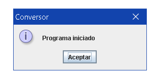
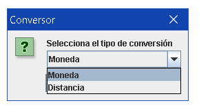
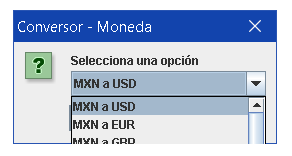
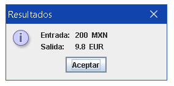
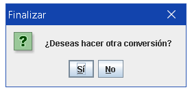
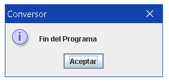
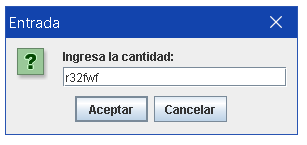
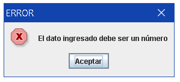

# Challenge ONE JAVA "Conversor de moneda"  

### Challenge de Alura: conversor de moneda creado con JAVA.
### Extra: conversor de distancia.
  Inicio del programa: 

  Selector de conversión: 

  Opciones de conversión: 

  Entrada: 

  Salida: 

  Pregunta: 

  Fin del programa: 

  Entrada no válida: 

  Manejo de errores (vuelve a selector de conversión): 

